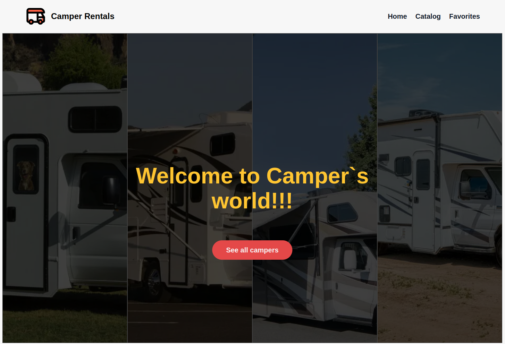

# Camper rentals app

### For:

An app for a company that provides campervan rental services in Ukraine

### Implemented:

1. Retrieve machine list from backend
2. Sort by location, equipment, machine form factor
3. Working with the Favorite Machines List
4. Order placement

### Mockup:

[Figma maket](https://www.figma.com/file/fnMWH0eBB7NnoqdAiiKWsQ/Test?type=design&node-id=0-1&mode=design&t=6RzJ3kbfsS1vIrhI-0)

### Tech stack:

HTML, CSS, React, Redux Toolkit, Styled-components, MUI, Axios

### Addons:

Formik, Yup, SweetAlert2, React-icons, Datapicker

### Backend:

[MockApi](https://mockapi.io/)

### Relized on:

React + Vite
